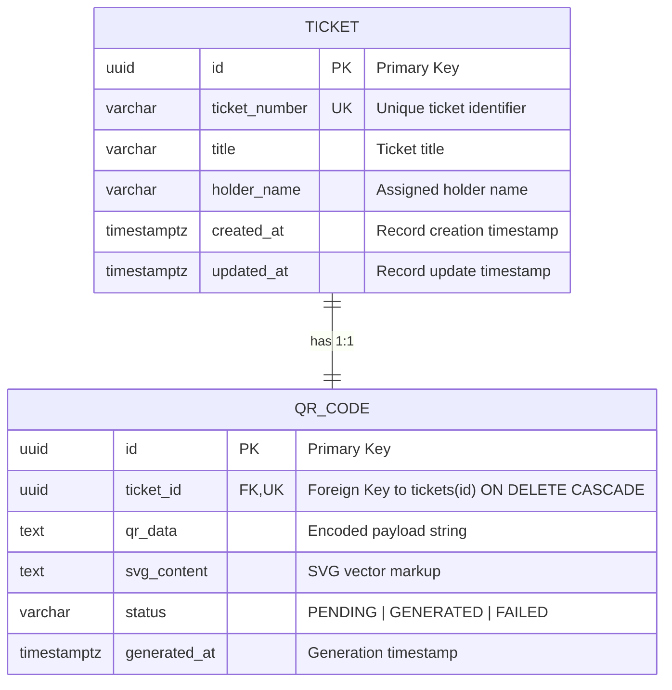

# Architectural Specification: Ticket QR Code Generator Worker

**Project:** Ticket QR Code Generator Worker  
**Ticket ID:** ENG-139055  
**Epic:** Core Infrastructure Overhaul  
**Priority:** P1 (High) | **Story Points:** 5  
**Status:** Architecture Finalized (Stage 1 - Planning)  
**Application Stack:** Vite + TypeScript  
**QR Rendering:** Scalable Vector Graphics (SVG)  

---

## 1. Requirement Analysis

### 1.1 Core Objectives
The **Ticket QR Code Generator Worker** is a specialized administrative interface and worker system designed to manage ticket records and generate associated QR codes with standardized, reliable data structures. It provides immediate responsiveness, robust error and empty-state handling, high-contrast monochromatic aesthetics, and strict accessibility.

### 1.2 Explicit Functional Requirements
- **Clear Interface:** Intuitive, monochromatic administrative UI for creating tickets, triggering QR generation, and browsing ticket records.
- **Immediate Responsiveness:** Instant UI response to user inputs without unnecessary full-page blocking or loading states.
- **Consistent Structured Data:** Output data structures are standardized and predictable for management reporting and downstream consumers.
- **Empty States:** When a list or search result contains no records, display a user-friendly `"No data found"` message rather than a blank screen or broken UI elements.
- **Asynchronous Operations & Slow Connectivity:** Visual loading indicator must be displayed during any asynchronous operations or simulated slow network requests.
- **Input Validation:** Invalid or missing form inputs must prevent submission, keep existing valid input intact, and clearly highlight the offending fields.

### 1.3 Non-Functional Requirements
- **Accessibility:** Target 100% Lighthouse accessibility score. All interactive elements must be keyboard navigable with appropriate ARIA labels and semantic roles.
- **Design System:** Clean, monochromatic corporate design (strictly black, white, and neutral grays—no arbitrary or rogue colors), using a consistent 16px (`--space-md`) and 32px (`--space-xl`) spacing scale.
- **Security:** Sanitize all text inputs against XSS before persisting or storing in application state. No hardcoded real API keys or sensitive PII.
- **Analytics:** Simulated console logging for completed primary actions (e.g., ticket creation, QR code generation, ticket search, list refresh).
- **AI Workflow:** Test-Driven Development (TDD) workflow with test specifications authored before feature code; all prompts logged to `PROMPTS.md`.

### 1.4 Excluded Speculative Domains
To prevent scope creep and adhere strictly to ticket ENG-139055, the following domains are explicitly excluded:
- Event tiers, seat numbers, concert/conference management.
- Attendee check-in or gate scanning workflows.
- Cryptographic HMAC / Ed25519 signing chains or fraud verification.
- Device / operator tracking and hardware scanning integrations.
- Payment processing, seat reservations, attendee badge printing.

---

## 2. Finalized Architectural Decisions

1. **Application Framework & Tooling:**
   - **Choice:** **Vite with TypeScript**
   - **Rationale:** Provides fast development iteration, static type safety for domain models, standardized bundling, and zero unnecessary runtime overhead.
2. **QR Code Presentation:**
   - **Choice:** **Scalable Vector Graphics (SVG)**
   - **Rationale:** SVGs render with crisp fidelity across all display densities, allow direct monochromatic styling via CSS, support accessible screen reader attributes (`role="img"`, `<title>`, and `aria-label`), and do not require external canvas dependencies.
3. **Worker & Persistence Layer:**
   - Client-side asynchronous worker architecture with simulated network latency to validate loading state indicators and async dispatch.

---

## 3. User Flows & System Behaviors

### 3.1 Main User Flow (Happy Path)

```mermaid
sequenceDiagram
    autonumber
    actor Admin as Administrator
    participant UI as Worker Interface (Vite + TS)
    participant Worker as QR Generator Worker / Service
    participant DB as Persistence Store
    participant Analytics as Console Analytics Logger

    Admin->>UI: Opens Ticket QR Code Generator
    UI->>Worker: Fetch tickets list
    Worker->>DB: Query stored tickets with QR data
    DB-->>Worker: Return ticket collection
    Worker-->>UI: Stored records returned
    UI-->>Admin: Render monochromatic ticket table & summary

    Admin->>UI: Enters Ticket Data (Ticket #, Title, Holder Name)
    Admin->>UI: Clicks "Generate Ticket & QR Code"
    UI->>UI: Sanitize & validate inputs (Client-side)
    UI->>UI: Display visual loading indicator (aria-live="polite")
    UI->>Worker: Submit ticket creation request
    Worker->>Worker: Encode ticket payload into SVG QR matrix
    Worker->>DB: Save Ticket and QRCode records
    DB-->>Worker: Confirmation
    Worker-->>UI: Return 201 Created (Ticket + SVG QR Code)
    UI->>UI: Hide loading indicator; prepend row to table
    UI->>Analytics: Output console log: [Analytics] Ticket Created
    UI-->>Admin: View newly generated ticket with crisp SVG QR Code
```

### 3.2 Normal Situations
1. **Initial Table Load:** The application renders existing tickets immediately in a structured monochromatic table with their respective SVG QR codes.
2. **Ticket Generation:** Form inputs validate immediately; upon submission, the UI shows a visual loading indicator while the worker encodes data into an SVG QR code, then updates the table and logs an analytics event.
3. **Instant Search / Filtering:** Typing in the search field filters tickets by ticket number, title, or holder name immediately with zero screen flickering.
4. **Analytics Telemetry:** Console output is logged upon completion of each primary action.

### 3.3 Error & Edge Case Situations
1. **Empty State (No Records or No Search Matches):**
   - *Trigger:* Empty database on first launch, or search query returns 0 matches.
   - *Behavior:* Renders a dedicated `"No data found"` empty-state container with `role="status"` instead of a blank screen or broken table layout.
2. **Invalid or Missing Form Inputs:**
   - *Trigger:* Submitting an empty form or invalid whitespace.
   - *Behavior:* Form submission is blocked. Offending fields receive a high-contrast visual outline, inline error messages appear below each invalid field, and `aria-invalid="true"` / `aria-describedby` are attached. Focus shifts to the first invalid field.
3. **Slow / Poor Connectivity & Asynchronous Latency:**
   - *Trigger:* Asynchronous worker generation or data retrieval takes time under simulated network delay.
   - *Behavior:* Visual loading indicator (monochromatic spinner / progress bar) is displayed with `role="status"` and `aria-live="polite"`. The submit button is disabled to prevent duplicate requests.
4. **Duplicate Ticket Identifier:**
   - *Trigger:* Submitting a ticket number that already exists.
   - *Behavior:* Rejection with inline message `"Ticket number must be unique"`. Previously entered valid field values are preserved.

---

## 4. Proposed Minimal Domain & Data Model

The domain is strictly scoped to two entities:

1. **`Ticket`**: Represents the primary business record.
   - `id`: UUID (Primary Key)
   - `ticketNumber`: String (Unique, e.g., `"TKT-1001"`)
   - `title`: String (e.g., `"General Admission Pass"`)
   - `holderName`: String (e.g., `"Jane Doe"`)
   - `createdAt`: ISO 8601 Timestamp
   - `updatedAt`: ISO 8601 Timestamp

2. **`QRCode`**: Represents the generated QR asset for the ticket.
   - `id`: UUID (Primary Key)
   - `ticketId`: UUID (Foreign Key, 1:1 with Ticket)
   - `qrData`: String (e.g., `"TKT-1001:<ticket-uuid>"`)
   - `svgContent`: String (The raw SVG XML string representation for visual rendering)
   - `status`: String (`"PENDING"` | `"GENERATED"` | `"FAILED"`)
   - `generatedAt`: ISO 8601 Timestamp

---

## 5. Database Schema & Entity Relationship Diagram (ERD)

### 5.1 Entity Relationship Diagram (Mermaid)



### 5.2 SQL DDL Definition
```sql
CREATE TABLE tickets (
    id UUID PRIMARY KEY DEFAULT gen_random_uuid(),
    ticket_number VARCHAR(64) UNIQUE NOT NULL,
    title VARCHAR(120) NOT NULL,
    holder_name VARCHAR(120) NOT NULL,
    created_at TIMESTAMPTZ NOT NULL DEFAULT CURRENT_TIMESTAMP,
    updated_at TIMESTAMPTZ NOT NULL DEFAULT CURRENT_TIMESTAMP
);

CREATE TABLE qr_codes (
    id UUID PRIMARY KEY DEFAULT gen_random_uuid(),
    ticket_id UUID UNIQUE NOT NULL REFERENCES tickets(id) ON DELETE CASCADE,
    qr_data TEXT NOT NULL,
    svg_content TEXT NOT NULL,
    status VARCHAR(20) NOT NULL DEFAULT 'GENERATED' CHECK (status IN ('PENDING', 'GENERATED', 'FAILED')),
    generated_at TIMESTAMPTZ NOT NULL DEFAULT CURRENT_TIMESTAMP
);

CREATE INDEX idx_tickets_ticket_number ON tickets(ticket_number);
CREATE INDEX idx_tickets_holder_name ON tickets(holder_name);
CREATE INDEX idx_qr_codes_ticket_id ON qr_codes(ticket_id);
```

---

## 6. API Contracts Summary

*(For detailed request/response schemas, see [docs/API_SPEC.md](API_SPEC.md))*

| Method | Endpoint | Description | Status Codes |
| :--- | :--- | :--- | :--- |
| `GET` | `/api/tickets` | List tickets with optional `?search=` query | `200 OK` (returns `{ data, total }`) |
| `GET` | `/api/tickets/:id` | Retrieve single ticket by UUID | `200 OK`, `404 Not Found` |
| `POST` | `/api/tickets` | Create ticket and generate SVG QR code | `201 Created`, `400 Bad Request`, `409 Conflict` |
| `POST` | `/api/tickets/:id/generate-qr` | Asynchronously regenerate QR code | `200 OK`, `404 Not Found` |

---

## 7. Validation & Security Rules

### 7.1 Input Validation Matrix
| Field | Type | Rules | Error Message |
| :--- | :--- | :--- | :--- |
| `ticketNumber` | String | Required, trimmed, 1–64 characters, unique | `"Ticket number is required and cannot be empty."` / `"Ticket number must be unique."` |
| `title` | String | Required, trimmed, 1–120 characters | `"Ticket title is required."` |
| `holderName` | String | Required, trimmed, 1–120 characters | `"Holder name is required."` |
| `search` | String | Optional, trimmed, max 100 characters | N/A |

### 7.2 Security Rules
1. **XSS Sanitization:**
   - All string inputs (`ticketNumber`, `title`, `holderName`, `search`) pass through a dedicated sanitizer before state insertion and rendering.
   - HTML tags, `<script>` tags, and dangerous attributes (`onload`, `onerror`) are stripped.
   - UI insertion uses safe DOM property assignment (`element.textContent`) rather than raw `innerHTML` for text.
2. **SVG Sanitization:**
   - SVG QR codes are generated strictly from clean mathematical matrix modules (`<svg viewBox="..." fill="currentColor"><rect .../></svg>`) without inline scripts or external references.
3. **No Sensitive PII or Credentials:**
   - No sensitive personal information or API secrets are stored or transmitted.

---

## 8. Accessibility Architecture (Target: 100% Lighthouse)

### 8.1 Monochromatic High-Contrast Palette
- **Background:** `#FFFFFF` (Pure White) or `#FAFAFA` (Off-White)
- **Primary Text & Headings:** `#0A0A0A` (Deep Charcoal/Black) — Contrast $\ge 18:1$ (WCAG AAA)
- **Secondary / Helper Text:** `#555555` (Muted Charcoal) — Contrast $\ge 7:1$ (WCAG AA)
- **Borders & Dividers:** `#CCCCCC` / `#E5E5E5` (Neutral Gray)
- **Interactive Focus Outline:** `2px solid #000000` with `2px offset` (clearly visible for keyboard users)
- **Consistent Spacing Scale:** Strictly 16px (`--space-md`) and 32px (`--space-xl`)

### 8.2 Keyboard Accessibility
- Tab navigation order follows logical visual layout: Form fields $\rightarrow$ Submit Button $\rightarrow$ Search Field $\rightarrow$ Table Rows.
- Full keyboard operability using `Tab`, `Shift+Tab`, `Enter`, and `Space`.
- Focus is never trapped and focus styling is never hidden.

### 8.3 Screen Reader & ARIA Semantics
- Semantic HTML tags: `<main>`, `<header>`, `<section>`, `<table>`, `<thead>`, `<tbody>`, `<form>`, `<label>`, `<button>`.
- Form inputs linked to `<label>` via `id` and `for`.
- Invalid fields marked with `aria-invalid="true"` and `aria-describedby="[field]-error"`.
- Loading indicator marked with `role="status"` and `aria-live="polite"`.
- Empty state container marked with `role="status"`.
- SVG QR code includes `<title>QR Code for Ticket [ticketNumber]</title>` and `role="img"`.

---

## 9. Simulated Analytics Telemetry

Primary actions log structured events to the developer console:

```typescript
export interface AnalyticsEvent {
  action: 'TICKET_CREATED' | 'QR_CODE_GENERATED' | 'TICKET_SEARCHED' | 'LIST_REFRESHED';
  payload: Record<string, unknown>;
  timestamp: string;
}
```

**Console Output Examples:**
- `[Analytics] Ticket Created: { ticketNumber: 'TKT-1001', id: '...', timestamp: '2026-09-28T09:30:00.000Z' }`
- `[Analytics] QR Code Generated: { ticketId: '...', qrData: '...', format: 'SVG', timestamp: '...' }`
- `[Analytics] Ticket Searched: { query: 'Jane', resultsCount: 1, timestamp: '...' }`
- `[Analytics] Ticket List Refreshed: { total: 10, timestamp: '...' }`

---

## 10. Test-Driven Development (TDD) Plan

Tests are authored **prior to** feature implementation.

### 10.1 Unit Tests (`tests/unit/`)
1. **`sanitizer.test.ts`**: Verifies XSS prevention, script stripping, and HTML entity escaping.
2. **`validator.test.ts`**: Verifies required fields, trimming, length limits, and duplicate checking.
3. **`qrGenerator.test.ts`**: Verifies SVG generation, valid SVG markup structure, and deterministic QR payload creation.
4. **`analytics.test.ts`**: Verifies that primary actions trigger structured console telemetry.

### 10.2 Integration Tests (`tests/integration/`)
1. **`form-validation.test.ts`**: Verifies submission prevention when invalid, field highlight, and focus management.
2. **`empty-state.test.ts`**: Verifies `"No data found"` renders when list is empty or search yields zero results.
3. **`loading-indicator.test.ts`**: Verifies loading indicator displays during async operations and hides on completion.
4. **`accessibility.test.ts`**: Validates keyboard navigation, ARIA attributes, and color contrast.

---

## 11. Project Directory Structure

```
ticket-qr-code-generator/
├── PROMPTS.md                       # AI prompt and workflow log (TDD requirement)
├── docs/
│   ├── ARCHITECTURE.md              # Architectural specification (this document)
│   └── API_SPEC.md                  # Comprehensive API contracts
├── src/
│   ├── core/                        # Domain logic, types, sanitization & validation
│   │   ├── types.ts                 # Ticket, QRCode, AnalyticsEvent interfaces
│   │   ├── sanitizer.ts             # Strict XSS input sanitizer
│   │   └── validator.ts             # Input validation logic
│   ├── services/                    # Business services & async worker
│   │   ├── ticketService.ts         # Ticket CRUD and persistence store
│   │   ├── qrWorker.ts              # Asynchronous SVG QR code generator
│   │   └── analytics.ts             # Console analytics logger
│   ├── ui/                          # Monochromatic presentation layer
│   │   ├── components/              # Reusable UI components
│   │   │   ├── Button.ts            # Monochromatic accessible button
│   │   │   ├── Input.ts             # Form input with validation and ARIA
│   │   │   ├── LoadingIndicator.ts  # Visual async progress / spinner
│   │   │   ├── EmptyState.ts        # "No data found" component
│   │   │   ├── TicketTable.ts       # Structured table with SVG QR rendering
│   │   │   └── TicketForm.ts        # Creation form component
│   │   └── styles/
│   │       ├── design-tokens.css    # Monochromatic palette, 16px/32px spacing
│   │       └── main.css             # Base styles and reset
│   └── main.ts                      # Application bootstrap
├── tests/                           # TDD test suites (written before implementation)
│   ├── unit/
│   │   ├── sanitizer.test.ts
│   │   ├── validator.test.ts
│   │   ├── qrGenerator.test.ts
│   │   └── analytics.test.ts
│   └── integration/
│       ├── form-validation.test.ts
│       ├── empty-state.test.ts
│       ├── loading-indicator.test.ts
│       └── accessibility.test.ts
├── index.html                       # HTML5 entrypoint with semantic landmarks
├── package.json                     # Dependencies & scripts
├── tsconfig.json                    # TypeScript compiler configuration
├── vite.config.ts                   # Vite bundler configuration
└── README.md                        # Project documentation
```
